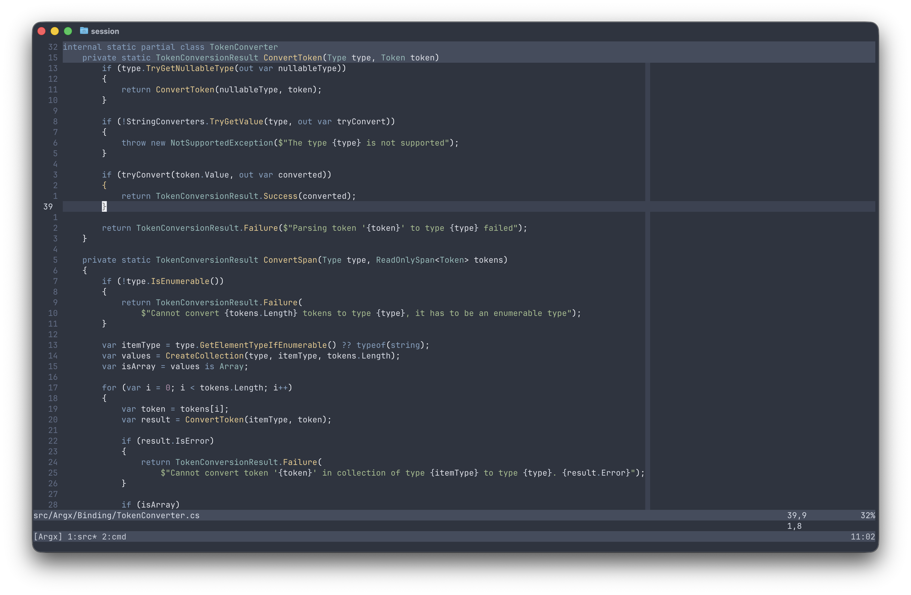

# Nord.nvim

Nord theme for neovim written in lua.



## Installation

Install the theme with your preferred package manager

``` lua
{
    'mihaicaragheorghe/nord.nvim',
    priority = 1000,
    config = function()
        require('nord').setup {}
        vim.cmd.colorscheme('nord')
    end,
}
```

## Usage

```
vim.cmd[[colorscheme nord]]
```

```
:colorscheme nord
```

## Configuration

`IMPORTANT` Set configuration before loading the colorscheme


<details>
    <summary>Defaults</summary>

``` lua
M.defaults = {
    transparent = false,
    style = {
        bold = true,
        italic = true,
        undercurl = true,
        underline = true,
    }
}
```

</details>

